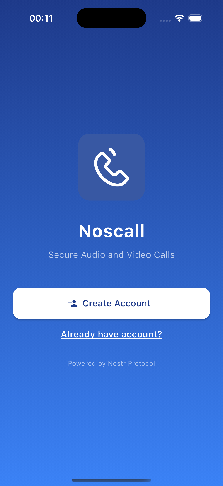
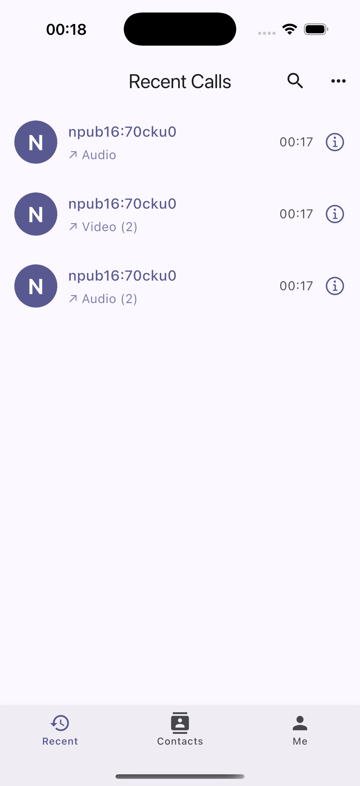
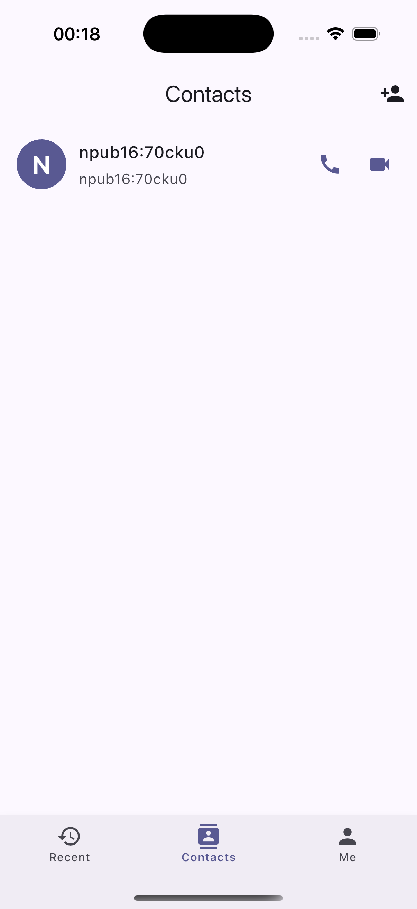
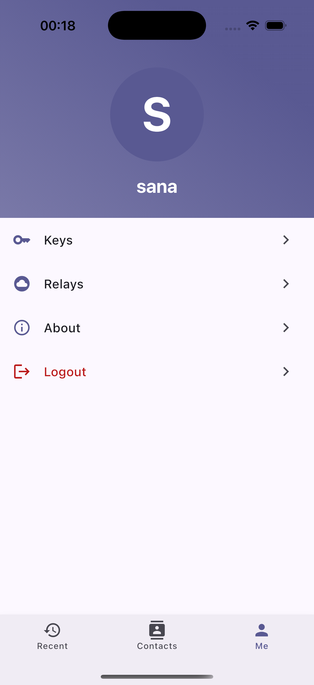

# NosCall

A secure audio and video calling app built on Nostr protocol. Features end-to-end encrypted calls with cross-platform support.

## App Screenshots

<table>
  <tr>
    <td></td>
    <td></td>
    <td></td>
    <td></td>
  </tr>
</table>

## Features

- Audio and video calls
- Cross-platform support (iOS, Android)
- Call history and contact management
- Compatible with other Nostr clients
- End-to-end encryption

### Running the code

Before running the app, please update the dependencies:

```bash
flutter pub get && flutter pub run build_runner build --delete-conflicting-outputs
```

Now you can run the project:

```bash
flutter run -d ios
flutter run -d android
```

### Tech Stack

- **Flutter**: 3.19+
- **Dart**: 3.0+
- **WebRTC**: flutter_webrtc for real-time communication
- **Nostr**: nostr_core_dart for protocol implementation

## Roadmap

Future versions will continue improving decentralized communication and customization capabilities.

### Planned Features

#### Completed 
- [x] **QR Code Scanning** - Easy contact discovery via QR code
- [x] **Profile Settings** - Customize your user experience
- [x] **Import Follower/Following List** - Seamless migration from other Nostr clients

#### In Progress 
- [ ] **Custom Relay Configuration** - Configure inbox relay and custom relay servers
- [ ] **ICE Server Configuration UI** - Advanced WebRTC connectivity options
- [ ] **Login via Nostr Signer** - Enhanced security with external signer support

#### Upcoming Features 
- [ ] **Friend Grouping & Favorites** - Organize contacts with groups and favorites
- [ ] **NIP-05 Identity Support** - Use your Nostr identity (e.g., user@domain.com)
- [ ] **Tor Network Support** - Additional privacy and anonymity layer
- [ ] **Push Notifications** - Real-time notifications for incoming calls and messages
- [ ] **Voice Messages & Call Recording** - Send voice messages and record calls
- [ ] **Dark Mode & Custom Themes** - Personalized appearance customization
- [ ] **Desktop Version** - Full desktop experience (Windows, macOS, Linux)
